# DRAFT-RL: Multi-Agent Chain-of-Draft Reasoning for Reinforcement Learning-Enhanced LLMs

This repository contains the implementation of **DRAFT-RL**, a framework that
combines multi-draft Chain-of-Draft reasoning, peer-guided evaluation,
reward-aligned selection, and PPO with imitation learning.

The current release provides executable method-smoke profiles for Qwen3-1.7B
and Qwen3-8B. Both profiles have completed the full method path on one NVIDIA
A40 GPU. These runs validate execution and checkpoint integrity; they are not
paper-scale benchmark or accuracy claims.

Paper: [arXiv:2511.20468](https://arxiv.org/abs/2511.20468) ·
[AAAI-26](https://doi.org/10.1609/aaai.v40i35.40195)

## Method

```mermaid
flowchart LR
    Q["Query"] --> A["Three LoRA Agents"]
    A --> D["Multi-Draft CoD Pool"]
    D --> P["Peer-Guided Evaluation"]
    P --> R["Learned Reward Model"]
    R --> S["Global and Local Selection"]
    S --> V["Verifier Reward"]
    V --> U["PPO and Imitation Update"]
    U --> A

    style Q fill:#E8F0FE,stroke:#3867D6,color:#111
    style A fill:#E8F7EE,stroke:#2D8A4E,color:#111
    style D fill:#FFF4D6,stroke:#C58B16,color:#111
    style P fill:#F5EAFE,stroke:#7D4AB5,color:#111
    style R fill:#FFE8E8,stroke:#C44D56,color:#111
    style S fill:#E8F7F7,stroke:#2A8C8C,color:#111
    style V fill:#FFF0E6,stroke:#C96B2C,color:#111
    style U fill:#E9ECFF,stroke:#5967C7,color:#111
```



For every query, each agent produces multiple concise drafts. Other agents
score each draft on coherence, step validity, relevance, completeness, and
answer correctness. A learned reward model ranks the candidates. The global
winner produces the displayed answer, while each agent's local winner supplies
its PPO and imitation target.

## Current status

| Profile | Shared policy | Agents | Drafts per agent | Learned RM | PPO + imitation | Save/reload |
| --- | --- | ---: | ---: | --- | --- | --- |
| `qwen3-1.7b` | Qwen3-1.7B | 3 | 2 | PASS | PASS | PASS |
| `qwen3-8b` | Qwen3-8B | 3 | 2 | PASS | PASS | PASS |

The method-smoke gates verify:

- six evaluation drafts and twelve non-self peer reviews per query;
- structured five-criterion review output;
- learned RM optimization and score-preserving reload;
- non-zero clipped-PPO gradients for all three agents;
- isolated LoRA updates with a frozen shared base;
- adapter parameter and fixed-input logit equality after reload;
- finite losses, ratios, rewards, and gradients.

`PASS` means the executable method path completed. It does not mean that the
selected answer was correct or that PPO improved accuracy.

### Capability boundary

- Qwen3-1.7B generated one correct candidate among six evaluation drafts, but
  that candidate violated the configured CoD constraint. The selected answer
  was incorrect.
- Qwen3-8B generated no correct candidate among six evaluation drafts. The
  selected answer was incorrect.
- One PPO update did not establish a capability improvement for either profile.
- The low RM training loss comes from a tiny calibration set and is not
  evidence of held-out generalization.

See [Method smoke results](docs/METHOD_SMOKE.md) for the exact scope and honest
capability boundary.

## Installation

The validated environment used Python 3.12, PyTorch 2.8.0 + CUDA 12.8,
Transformers 4.57.6, and PEFT 0.17.1.

```bash
python3 -m venv .venv
source .venv/bin/activate
python -m pip install --upgrade pip
python -m pip install -e .
```

Set the Hugging Face cache outside the repository if desired:

```bash
export HF_HOME=/path/to/hf-cache
```

## Run

Qwen3-1.7B:

```bash
PYTHONPATH=src .venv/bin/python scripts/run_method_smoke.py \
  --config configs/method_smoke_1.7b.json
```

Qwen3-8B:

```bash
PYTHONPATH=src .venv/bin/python scripts/run_method_smoke.py \
  --config configs/method_smoke_8b.json
```

Each run writes an auditable bundle to `artifacts/<run_id>/` containing:

```text
config.json
data_freeze.json
trajectories.jsonl
train_metrics.jsonl
summary.json
demo.md
checkpoints/
```

Run deterministic unit tests with:

```bash
python -m pytest -q
```

## Repository layout

```text
configs/              Smoke profiles
docs/                 Method and validation notes
examples/             Compact successful-run evidence
scripts/              Entry point
src/draftrl/           CoD, peer review, RM, PPO, and orchestration
tests/                 Deterministic unit tests
```

## Scope

The included profiles intentionally use a tiny fixed GSM8K subset, `K=2`, a
small learned hashed-text reward scorer, and one PPO iteration. The public
profiles use Qwen3 policies. They do not include the paper's full six-dataset,
five-seed, Claude-based experimental table, and they do not claim an accuracy
gain.

## Citation

```bibtex
@article{li2026draftrl,
  title={DRAFT-RL: Multi-Agent Chain-of-Draft Reasoning for Reinforcement Learning-Enhanced LLMs},
  author={Li, Yuanhao and Liu, Mingshan and Wang, Hongbo and Zhang, Yiding and Ma, Yifei and Tan, Wei},
  journal={Proceedings of the AAAI Conference on Artificial Intelligence},
  volume={40},
  number={35},
  pages={29530--29537},
  year={2026},
  doi={10.1609/aaai.v40i35.40195}
}
```
